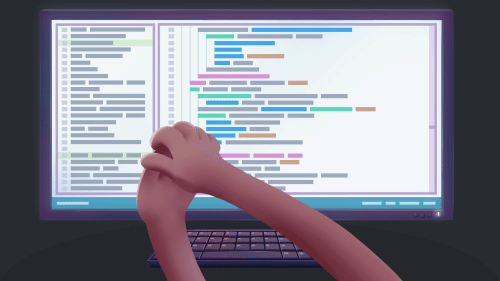

# Ethical Dilemmas in Software Development

[Survey](https://nkluge-correa.github.io/AIRES-Ethical-Dilemmas/)

This repository holds a redirection link to the **Ethical Dilemmas in Software Development** surveys.

## To Do

- [X] Add the missing GIF.
- [X] Update the video.
- [X] Spellchecking and grammar revision.
- [x] Pilot test.
- [ ] Data collection.

## Funding

This research was funded by RAIES ([Rede de Inteligência Artificial Ética e Segura](https://www.raies.org/)). RAIES is a project supported by FAPERGS ([Fundação de Amparo à Pesquisa do Estado do Rio Grande do Sul](https://fapergs.rs.gov.br/inicial)) and CNPq ([Conselho Nacional de Desenvolvimento Científico e Tecnológico](https://www.gov.br/cnpq/)).

    

## License

Worldwide AI Ethics is licensed under the CC-BY-NC license, Version 4.0. See the [LICENSE](LICENSE) file for more details.
